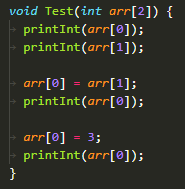
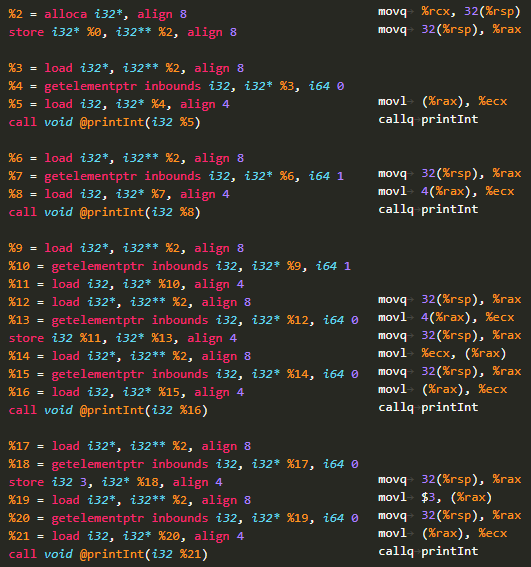
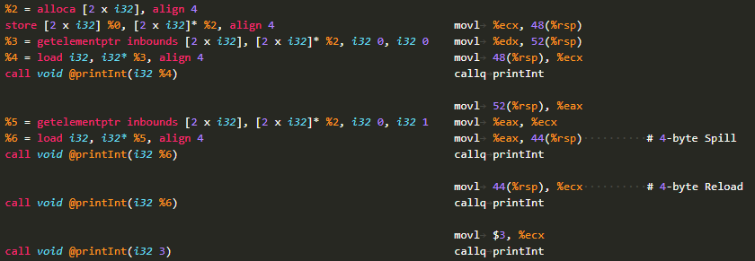
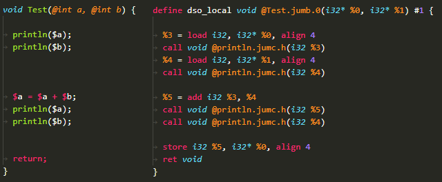
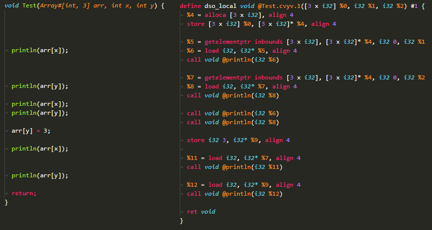
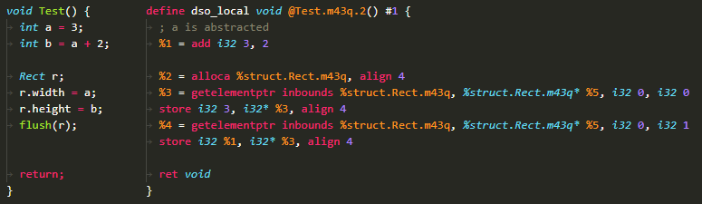
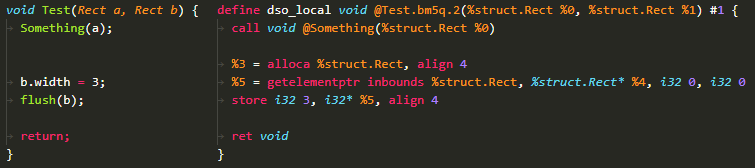

Title: Latent Access Optimisations
Date: 1/08/2020
Tags:
Related: ./doc/qupa-decision-pointers.md
---
How delaying memory reads, write and execution can have a compounding optimisation effect
---

> THIS DOCUMENT IS STILL UNDER DEVELOPMENT AND STILL CONSIDERED DRAFT FORM

## Abstract

When CPU registers/stack values are reused instead of reloading variable values there can be a decreased number of instructions performed, and loads required. Similarly, if you hold computation results in registers, and only write the value to memory when necessary some writes may not need to be performed as values get overwritten, or are never parsed/accessed by address.

These two effects combined with only allocating memory when accessing the address of the element is necessary - can completely remove some variables from the heap and instead they are completely resolved within registers/stack values without any extra processing or analysis required.

## Asumptions

These optimisations presume:

1. _Single-Threaded Execution_ - hence if they are used in a multithreaded environment they can cause unexpected behaviour. However, this does not mean that they cannot be used for multithreaded applications, instead if means that consideration about multithreaded concurrency is required when implementing a program using these optimisations, such as marking points where the values should be flushed, or any caches should be dropped.
2. _Single Parse_ - a given function should be compiled in a single sweep. This means effects can only be accounted for linearly, hence in a section of code where looping occurs assumptions or known information may be discarded.
3. _Functional Independance_ - all functions are compiled only knowing their own behaviour, and cannot affect the behaviour of other functions and instead may only assume information provided during earlier stages of compilation (i.e. function signatures). Hence one function does not know what will occur to any value parsed to another. Hence when pointers are parsed to other functions, all known information about the pointer's value is lost.

The drawbacks created from these assumptions can be reduced by adding higher-level constructs such as variable synchronisations points when values are shared by address across threads. Marking certain function arguments as being immutable, hence they will not affect the value of any parsed pointers.

## Background

Throughout this article, the focus is on LLVM-IR level of abstraction. This has been chosen due to it's high proximity to assembly and thus machine code - however it still maintains a relatively high level of readability, thus making explanations and examples simpler.

### About LLVM-IR

Within LLVM local variables are typically defined as purely addresses via the instruction ``alloca typename``. This static allocation is typically translated to a section of memory on the heap for a given function however this is not always the case due to the target platform/assembly's behaviour. However reducing the number of ``alloca``s will reduce the stack size, and thus in most cases also reduce the number of reads required from different levels of CPU cache, decreasing latencies and delays within a program which impacts performance.

All variables can only be assigned once within LLVM. Hence if you want a variable you need to define an address to the type you want, then you read and write to that address. However, that local variable name cannot be assigned multiple times within the same function. This is not the same as a constant - however, because if the execution jumps to a previous line (for example during a while loop), then the value of the local variable will change.

## Terms

| Term | Used to mean |
|:-|:-|
| Register | A local LLVM variable |
| Concurrency | Used within this document to refer to the more broad interpretation of any execution occurring within the same period. Hence it can apply to single-threaded behaviour, such as calling a function within another. The child function is enacting concurrent behaviour because it occurs during the same time as the caller. |

## 1. Read Caching

> When a value is read, from memory the register used to store the result should be reused in place of reloading the value until such as time as the original is altered or presumed to have changed in some way.

### 1.1. Example

The below example was compiled with both Clang++ and also transpiled then compiled with Qupa which utilises the optimisations described in this document.



#### 1.1.1. Clang++ Generation

The C++ compiled version is 19 lines of assembly and includes multiple redundant reloads, and recalculations of addresses. Please note that C++ aims for assembly-level linking compatibility, hence why it is using integer pointers rather than an array at the LLVM-IR level.



#### 1.1.2. Qupa Generation

The Qupa compiled version is only 12 lines of assembly because it reused as many values as it could, hence for some prints no extra calculations were needed to run the next print. And in the final case the compiler knows that the value at that point is a constant primitive - hence it instead directly uses that value rather than requiring any registers to be used.

Also, note that the two assignments are not computed. This is because there is no accessing of sub-components for the values, hence they can just be kept in registers in the whole form. This is covered later in [stage 2](#2-latent-writing).



---

### 1.2. Risks and Mitigation

The two main risks created from read-caching are related to aliasing (multiple ways of accessing the same information). For instance when a pointer is passed to a function, then the function proceeds to read and write to that point, that is a separate alias to the data than the original calling function used.
Similarly, when a subcomponent of a variable (i.e. and an element of an array) is accessed dynamically, there may be multiple aliases to the same sub-component (i.e. ``p[x]``, ``p[y]``, where ``x == y``).

#### 1.2.1. Function calls and pointer
Due to [asumption #3](#asumptions), when an address is parsed to another function it cannot be determined if the function will alter the value, or how it will access it. Hence we must perform certain actions before and after the call:
* Preamble (before): The any values purely stored in registers for this variable must be flushed and thus written to the memory address so they can be read by the child function.
* Epilog (after): Once the function has been executed the resulting state of the value is unknown, hence any cached values must be dropped.

#### 1.2.2. Dynamic Accessing of Sub-Components

To determine the address of a dynamic-access requires computing the access itself, which then requires computing the code around it which is then interpreted rather than compiled behaviour. Hence any dynamic access is treated as a complete unknown. Hence if we access element ``x`` and element ``y`` of an array ``p``, even if both ``x`` and ``y`` at that point in time may theoretically both be the same value, they should still be treated as unique accesses with unique caches. This may lead to duplicate caches of the same information in memory, however, this can be improved in later versions of this algorithm, and detail more concerned with implementation.

Writing is, however, a very costly process in comparison to reads. Because we cannot determine where exactly the data is being written two, and which other aliases (i.e. ``p[x]``, ``p[y]``) might be affected, when any write is performed to a sub-component, that value must be properly written into memory, and all other caches for the value must be dropped.

## 2. Latent Writing

> Only write to memory once:
> 1. An address access must occur on the value (i.e. accessing a sub element)
> 2. The end of execution when a concurrent value has been altered (i.e. when a function returns, or when an asynchronous function pauses and the function is using a pointer parsed via an argument)

### 2.1. Example: Pointer Argument Assignment

This example shows how changes to a concurrent variable must be flushed once the function exits (aka returns).


The example first prints the two integers, as neither of them have been loaded into registers, both prints require one load to occur.
Next the value at ``a`` is assigned to the value of itself plus the value of ``b``. Note that this value is not written to memory at this point, as the address is not in use.
After that the new ``a`` and ``b`` values are printed - as ``b`` is already cached the value from before can be reused as ``b`` has not changed; and the value of ``a`` is known already due to the computation result being in a local register.
Finally when the function exits the value of ``a`` is written to the correct location, hence the side effects are perceivable from the caller.

### 2.2. Example: Dynamic Array Access Assignment

This example takes an array of length three, and two integers - because then the value of ``x`` and ``y`` are completely unknown and the compiler won't resolve them to constants.


When ``arr[x]`` and ``arr[y]`` are first accessed their locations need to first be determined, then their values can be loaded. These cached results are then used when they are reprinted.
However once the assignment ``arr[y] = 3`` occurs the value of ``arr[x]`` is now unknown, because the compiler cannot determine if ``x == y`` - hence it drops all cached values, and reloads the necessary values.

Note that the current implementation of Qupa's compiler clears all GEP caches, which means ``arr[y]`` needs to be reloaded even though the value is now known to be ``3``.

Also note that only ``arr`` is allocated as a local variable because address access is used on that variable, however for ``x`` and ``y`` no such address access is used, so no allocation is required.

## 3. Latent Allocation

> Only allocate memory for a variable once a [latent write](#2-latent-writing) must be performed

Through out these examples there is a function used called ``flush()``, this is simply to force some writes to occur, otherwise these examples would perform no writes to memory.

### 3.1 Example: Allocating & Using a Variable



First ``a`` is assigned to the constant value of ``3`` which does not need to be written yet as the address has not yet been accessed.
Then the computation for ``b`` is cacluated and again not written as it has not yet been accessed by address.
Since both ``a`` and ``b`` are known their values can simpily be assigned to the address of ``width`` and ``height`` of rectangle ``r``.

Both ``a`` and ``b`` are never written to memory in this function as they do not need to be.

### 3.2 Example: Using & Manipulating Arguments



First ``a`` was parsed as an argument to the function ``Something()``, then through the function it was never accessed by address, so it never needed to be properly allocated as a local variable.
Then ``b.width`` was changed however, which then required ``b`` to be stored at an address, hence it was allocated space as a local variable, then that address was able to be used to access the sub component ``.width`` and modify it. Note that ``flush(b)`` is simply there to force ``b.width`` to be written or else these five lines of LLVM would never be generated as the value would not need to be written.

## Implementation

This sections goal is to illurate some cases where the rules can easily be broken by over looking certain implementation detail in the optimisation.

### Argument Pointers

When a function is parsed a pointer, and the value is changed locally or parsed to another function that may change the pointer's value. Those changes must be flushed (written to memory) before the function execution ends. Otherwise the changes will not be perceivable and rule 2 will be broken.

Within Qupa this problem is circumvented by flushing any variables flagged as ``concurrent`` before returning. The compiler flags function variables which are pointers as ``concurrent variables``, because their changes must be perceivable out of the current execution stream (from the caller).

### Branches

Branches such as if/else statements and switches create execution paths that may not be executed. Hence a variables cache may be replaced in one branch and not another. This means that when the cache needs to be accessed later it is perceived as being in two possible states. A naieve solution to this is to flush any altered variables at the end of an if/else statement block then require a reload the next time the value is executed.

This method however introduces and extra load which is not necessary due to a concept called ``phi`` in LLVM. There is a code example [here](https://github.com/qupa-lang/Qupa/issues/37), and ``phi`` blocks are explained further in [Implementation: Loops](#loops).

### Loops

```qupa
int i = 0;
while (i < 10) {
	print(i);
	i = i + 1;
}
```
During the first execution of the while loop clearly the value of ``i`` is ``0``, however during the preceeding loops it is now a cache value. The naieve approach would be to simply flush any caches before a while loop, then reload the values on each loop.

A more advanced method would be to have a ``phi`` statement at the beginning of every loop for all values changed in the loop. Hence the cached for the value ``i`` in this cache can be ``%first_cache = phi [0, %begin ], [ %last_cache, %loop ]``, where ``first_cache`` is the register used from the beginning of the loop, and ``last_cache`` is the register holding the value for ``i`` at the end of the loop. This has the added benifit that after the loop we know the value for ``i`` is stored in ``last_cache``. A code example can be found [here](https://github.com/qupa-lang/Qupa/issues/38).

A quite brief on ``phi`` - it behaves like a select statement, expect it is based on which execution block was executed before the ``phi``. In the example above, if the block that jumped to the loop was ``%begin`` then the value returned would be ``0``, but if it was from the loop itself the value would be ``%last_cache``.


## Future Improvements

A second parse could be performed going backwards on outputted LLVM-IR to ensure all local variables are used. For instance the current optimisations could produce a line ``%c = add i32 %a, %b`` where the value of ``%c`` is never later used. Computations like this could be removed, however due to the numbering scheme of LLVM registers this would require renaming local variables as local variables must be defined in sequential order not skipping any numbers.